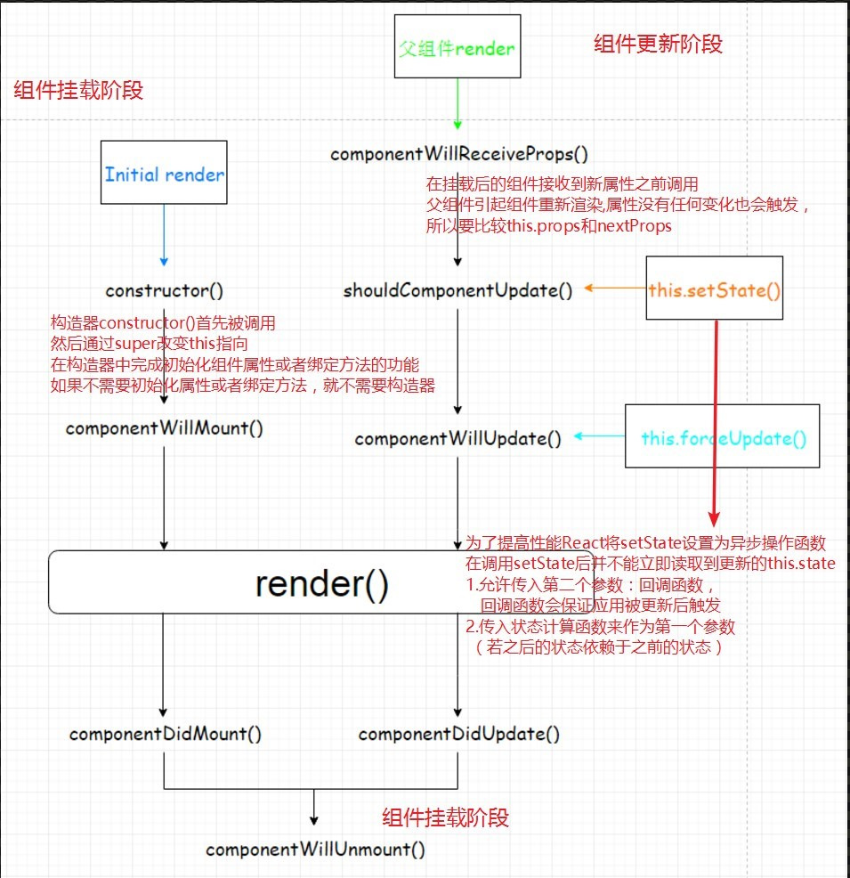
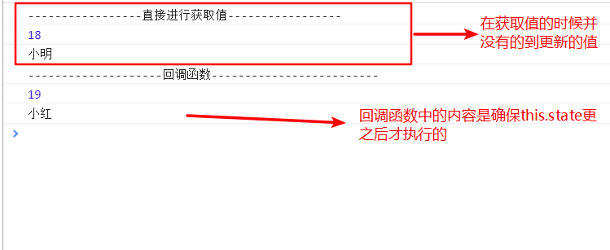

## react入门笔记
### 1.创建react组件
#### 1.1. 无状态函数式组件
组件的表现形式为：带有一个`render()`方法，通过ES6 `arrow function`创建或者通过普通函数创建
```js
function HelloComponent(props) {
    return <div> Hello {props.name}</div>
}
```
特点：
* 可读性好，减少代码冗余，精简至一个`render()`方法
* 组件只能访问输入的`props`，无法访问组件中的`this`对象（没有实例化过程）
* 组件无法访问生命周期的方法

官方指出： **在大部分`react`组件中，大部分组件被写成无状态组件，通过简单的组合可以构成其它组件，**
**这种通过简单组件然后合并成一个大应用的设计模式被提倡**
#### 1.2. React.Component(推荐使用)
es6的继承
```js
// 使用class定义构造函数
class Person {
    // 定义对象的属性
    // 传入成员变量，可以给属性初始值或默认值
    constructor (name,age=25) {
        this.name = name;
        this.age = age;
    };
    // 定义对象的方法
    showName () {
        return this.name;
    };
    showAge () {
        return this.age;
    }
}

const per = new Person('hello',28);
// console.log(per.name,per.age); // hello, 28

// 子类继承父类
class Worker extends Person {
    constructor(name,age,job="砍柴"){
        // 把原来构造函数的参数传入
        // 必须调用super方法，相当于call/apply改变子类this的指向
        // 否则子类得不到this对象
        super(name,age);
        this.job = job;
    };
    showJob () {
        return this.job;
    }
}

const wor = new Worker('ff',75);
// console.log(wor.showJob()); //砍柴
```
利用ES6的继承书写`React`组件，配置propTypes和defaultProps是作为组件的类的静态属性
```js
class Contacts extends React.Component {
    constructor(props) {
        super(props)
        // 设置初始化state
        this.state = {
            age: 18,
        }
    }
    static propTypes = { // 类的静态属性
        name: React.PropTypes.string
    }
    static defaultProps = { // 类的静态属性
        name: '',
    }
}
```

> 总结：
> 1. 只要有可能，尽量使用无状态组件形式
> 2. 要用到state，生命周期方法等，使用`React.Component`这种形式创建组件

### 2. `react`生命周期
#### 2.1. react生命周期过程
* 组件挂载阶段：
   constructor
   componentWillMount
   render
   componentDidMount
* 组件更新阶段：
   componentWillReceiveProps: 在挂载后的组件接收到新属性之前调用
   shouldComponentUpdate
   render
   componentDidUpdate
* 组件卸载阶段
   componentWillUnmount


#### 2.2. setState需要注意的点
初始的`state`
```js
this.state = {
    age: 18,
    name: '小明',
}
```
为了提高性能`react`将`setState`设置为异步操作函数，在调用`setState`后并不能立即读取到更新的`this.state`
解决办法：
* 允许传入第二个参数：回调函数，回调函数会保证应用更新后触发
```js
handleClick() {
    this.setState(
        {
            age: this.state.age+1,
            name: '小红',
        },
        () => {
            console.log('--------------------回调函数-------------------------');
            console.log(this.state.age);
            console.log(this.state.name);
        }
    )
    // 先执行后边的代码
    console.log('-----------------直接进行获取值-----------------');
    console.log(this.state.age);
    console.log(this.state.name);
}
```


* 传入状态计算函数来作为第一个参数（若之后的状态依赖于之前的状态）
```js
handleClick() {
    // 相当于object.assign({},{age:19},{age:19}):会将相同的属性进行合并，并不会每次点击+2
    this.setState({age: this.state.age+1});
    this.setState({age: this.state.age+1});
}
```
并不是我们想要的效果

官方推荐写法
```js
// 官方推荐写法：(保证数据的同步性，之后的状态要依赖于之前的状态)
// 这样更改之后会立即生效
this.setState((prevState,props) => {
    // prevState:之前的this.state
    // props:父组件传来的属性组成的对象
    // 必须要将修改的内容return,否则不会生效
    return {age: prevState.age+1}
})
this.setState((prevState,props) => {
    return {age: prevState.age+1}
})
```

